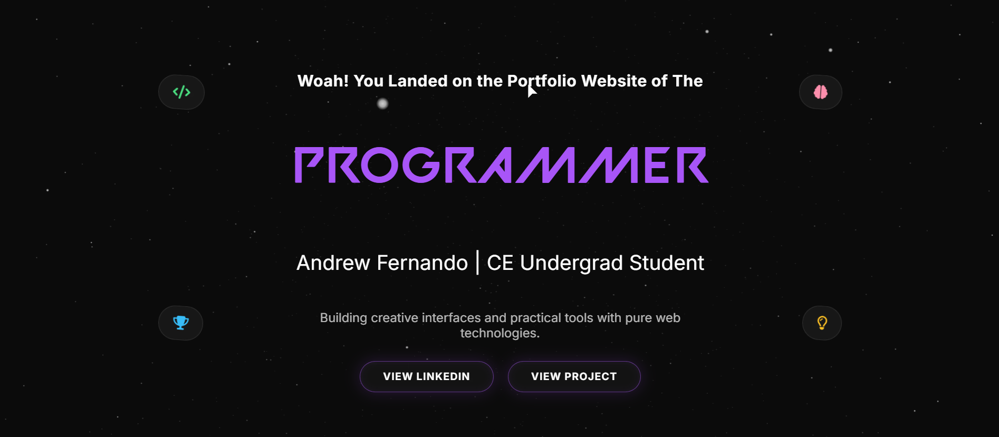

# Andrew Fernando | Personal Portfolio 🖥️

Welcome to my personal portfolio repository!  
This is a modern, interactive portfolio website designed to showcase my coding projects, technical skills, and engineering journey. It is built with a focus on an immersive user experience, utilizing modern web technologies, sleek animations, and 3D graphics.

---

## 🚀 Live Demo

[View my live portfolio here!](https://Andrew-Fernando-15.github.io/portfolio-practice/index.html) *(Note: Update this link if hosted elsewhere)*

---

## 🌟 Website Sections

- **Home:** Interactive 3D hero section with a dynamic typing effect.
- **About:** Personal introduction, background, and approach to development.
- **Projects:** Showcase of my recent work including Mr.Fernando OS, Student Management System, and ChainGuard.
- **Skills:** Interactive, filterable grid displaying my core technical expertise (Languages, Frontend, Tools).
- **Certifications:** Academic and professional learning milestones.
- **Contact:** Functional contact form to get in touch directly.

---

## ⚡ Key Features

- **3D Interactive Background:** Immersive starfield particle background built with **Three.js** that responds to mouse movement.
- **Smooth Animations & Interactions:** Scroll-triggered animations, custom cursor, and dynamic layouts powered by **GSAP** & **ScrollTrigger**.
- **Dynamic Preloader:** Sleek boot-sequence preloader that transitions smoothly once the page is fully loaded.
- **Floating Navigation:** Interactive navbar that highlights the active section as you scroll.
- **Skill Filtering System:** Categorized, smoothly animated filtering for technical skills.
- **Fully Responsive Design:** Optimized for a seamless experience across desktop, tablet, and mobile devices.

---

## 🛠️ Technologies Used

- **Frontend Core:** HTML5, CSS3, Vanilla JavaScript
- **3D Graphics:** [Three.js](https://threejs.org/)
- **Animations:** [GSAP](https://gsap.com/) & ScrollTrigger
- **Icons & Typography:** FontAwesome, Devicon, Google Fonts (Inter, Montserrat)

---

## 📩 Contact

- **Email:** [andrewafdo@gmail.com](mailto:andrewafdo@gmail.com)
- **Location:** Mumbai, India
- **LinkedIn:** [Andrew Fernando](https://linkedin.com/in/andrew-fernando-b6362a346)
- **GitHub:** [Andrew-Fernando-15](https://github.com/Andrew-Fernando-15)

---

_Made with ❤️ by Andrew Fernando_
